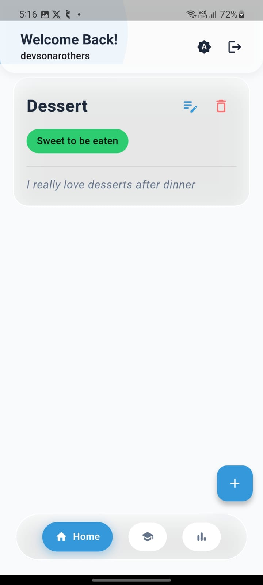
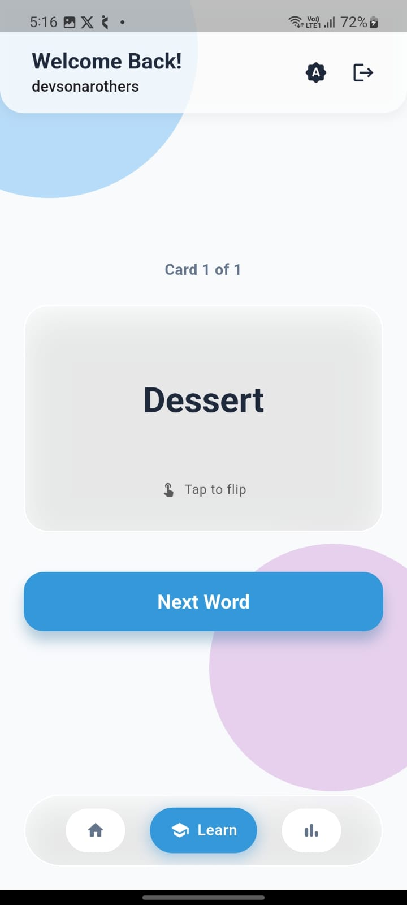
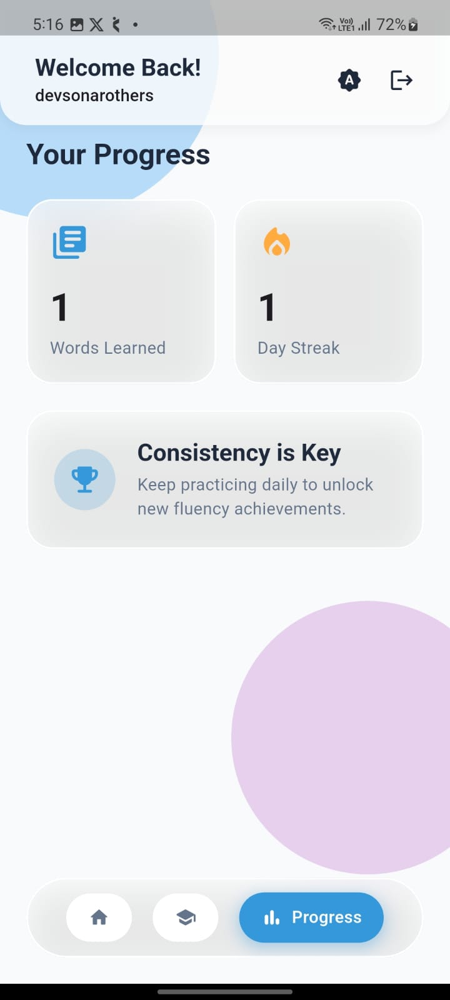
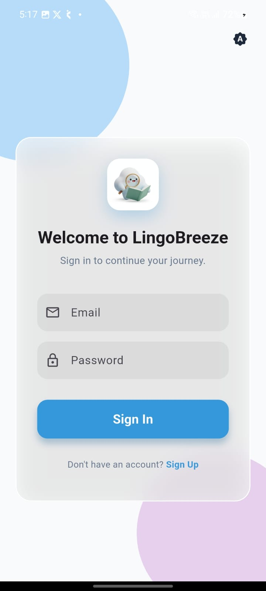
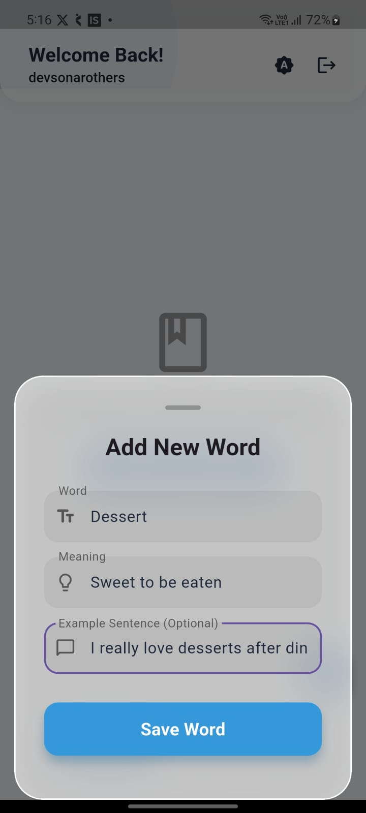
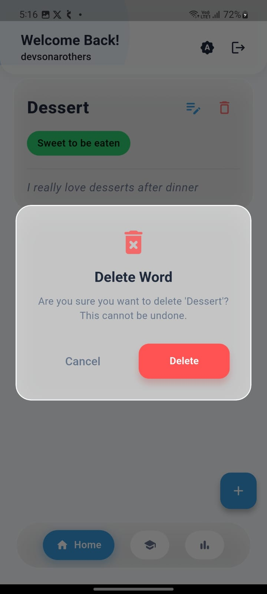

# LingoBreeze

**LingoBreeze** is a premium, beautifully crafted vocabulary building and flashcard application built with Flutter. It features a stunning "frosted glass" (glassmorphism) aesthetic, robust state management using BLoC, and seamless cloud synchronization with Firebase.

## 📱 App Gallery

|                     Home Screen                      |                  Learn (Flashcards)                   |                    Progress Dashboard                    |
|:----------------------------------------------------:|:-----------------------------------------------------:|:--------------------------------------------------------:|
|              |              |              |

|               Login Screen                |                Add Word Modal                 |                   Delete Dialog                   |
|:-----------------------------------------:|:---------------------------------------------:|:-------------------------------------------------:|
|  |  |  |

## ✨ Features

### 🎨 Premium UI/UX (Glassmorphism)
* **Frosted Glass UI:** Custom `GlassContainer` implementations providing an Apple-like translucent aesthetic.
* **Animated Backgrounds:** Dynamic, colorful floating orbs that interact with the frosted glass blur.
* **Fluid Transitions:** Custom Scale, Fade, and Slide animations when navigating between tabs.
* **Custom Modals & Dialogs:** Fully transparent, glass-themed bottom sheets and alert dialogs.
* **Theme Engine:** Persistent System/Light/Dark mode toggling powered by `shared_preferences`.
* **Native Polish:** Custom app launcher icons and native splash screens.

### 📚 Core Functionality
* **Firebase Authentication:** Secure Email/Password registration and login.
* **Complete CRUD:** Add, Read, Edit, and Delete vocabulary words with definitions and example sentences.
* **Interactive Flashcards (Learn Tab):** Tap-to-flip animated flashcards for active recall practice.
* **Progress Dashboard:** Real-time tracking of words learned and current study streaks.
* **Cloud Sync:** All data is securely stored and instantly synced via Cloud Firestore.

## 🛠️ Tech Stack
* **Framework:** [Flutter](https://flutter.dev/) (Dart)
* **State Management:** [flutter_bloc](https://pub.dev/packages/flutter_bloc) (BLoC/Cubit)
* **Backend:** Firebase (Auth & Cloud Firestore)
* **Local Storage:** `shared_preferences` (for theme persistence)
* **Assets:** `flutter_launcher_icons`, `flutter_native_splash`

## 🚀 Getting Started

### Prerequisites
* Flutter SDK installed ([Install Guide](https://docs.flutter.dev/get-started/install))
* A Firebase project configured for Android/iOS.

### Installation
1.  **Clone the repository**
    ```bash
    git clone https://github.com/Devsonar19/Lingobreeze.git
    cd lingobreeze
    ```
2.  **Install dependencies**
    ```bash
    flutter pub get
    ```
3.  **Setup Firebase**
    * Ensure your `google-services.json` (Android) and `GoogleService-Info.plist` (iOS) are placed in their respective directories.
4.  **Run the App**
    ```bash
    flutter run
    ```

## 📂 Project Structure
Following a feature-first Clean Architecture approach:
* `lib/core/` - Global themes, glassmorphism widgets, and utilities.
* `lib/features/auth/` - Login, Registration, and Auth BLoC.
* `lib/features/main_nav/` - Floating bottom navigation and screen transition logic.
* `lib/features/vocabulary/` - Home list, CRUD modals, Flashcards, and Repository.
* `lib/features/progress/` - Statistics and achievement dashboard.
